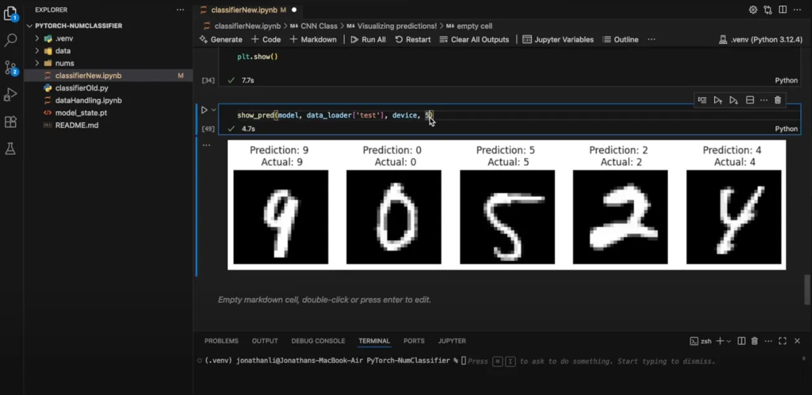

# PyTorch number classifier using MNIST dataset

This uses a CNN for digit classification using the MNIST dataset for digits. The MNIST dataset is accesible through torchvision.datasets (which also has a ton of datasets such as the CIFAR-10 for 10 classes of images). Or you can get the datasets from places like Kaggle too.

